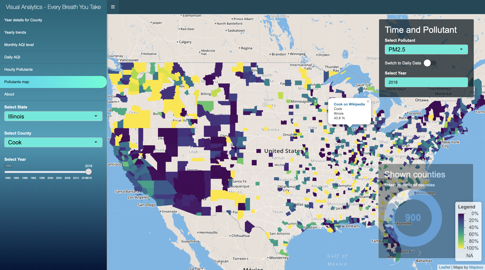

# VisualAnalytics-EveryBreathYouTake

This is the second project repository for the CS 424 Visualization and Visual Analytics class at UIC. It consists in various visualizations and interactive plots in a web application created using the Shiny library for R. The visualizations are about the Air Quality dataset by County in the United States, concentrating on the daily and hourly data. 

Learn more at the webpage of the project:
[Go to website of project](https://mirkomantovani.com/projects/EveryBreathYouTake.html)

Play with the application yourself:
[Access application on Shinyapps.io](https://mirkomantovani.shinyapps.io/EveryBreathYouTake/)

### Authors
* Mirko Mantovani
* Ashwani Khemani
* Abhishek Vasudevan

